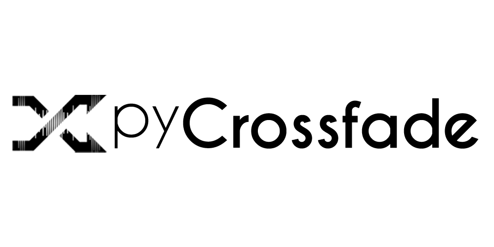
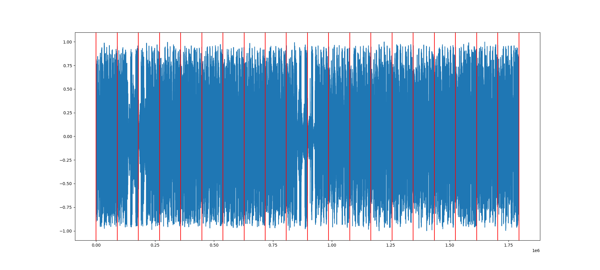
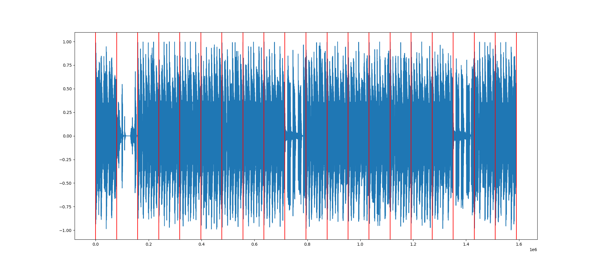
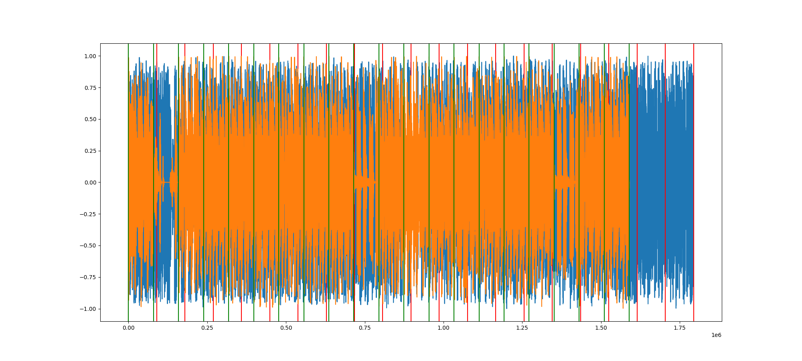

pyCrossfade is born out of a personal effort to create a customizable and beat-matched crossfade functionality.

---------

## Installation

### Dependencies

This project requires *libsndfile*, *rubberband-cli*, *ffmpeg* to be installed on the system to work.

### Linux

```bash
apt-get update && apt-get install -y libsndfile1 rubberband-cli ffmpeg
```

### OSX


##### libsndfile
```bash
brew install libsndfile
```
##### ffmpeg
```bash
brew install ffmpeg
```

##### rubberband
```bash
brew install rubberband
```
-----

### Python Dependencies

#### Installation

To install the projects dependencies run:

```bash
pip install -r requirements.txt
```

*!* _if you get an error about `Cython` refer to [this tip.](https://github.com/oguzhan-yilmaz/pyCrossfade#a-note-on-the-python-dependencies)_

|Package|Used For|
|---|---|
|[Cython](https://github.com/cython/cython) | Required by _madmom_ package.|
|[Numpy](https://github.com/numpy/numpy)|Handling audio data.|
|[pyrubberband](https://github.com/bmcfee/pyrubberband)|Python wrapper for rubberband, a perfectly capable time stretcher & pitch shifter.|
|[yodel](https://github.com/rclement/yodel)|Audio frequency filtering capabilities.|
|[essentia](https://github.com/MTG/essentia)|Format resilient audio loading and it's [MIR](https://en.wikipedia.org/wiki/Music_information_retrieval) tools.  	    |
|[madmom](https://github.com/CPJKU/madmom)|_State of the art_ beat-tracking.|

#### A note on the Python dependencies
Installing `madmom` package alone, if `Cython` package is not installed before hand, can fail. To solve this problem, you can `pip install cython` before installing madmom package.


----
## Example Usage
#### Transitioning Between Two Songs
```python
from pycrossfade.song import Song
from pycrossfade.transition import crossfade
from pycrossfade.utils import save_audio
# creating master and slave songs
master_song = Song('/path/to/master_song.mp3')
slave_song = Song('/path/to/slave_song.mp3')
# creating crossfade with bpm matching
output_audio = crossfade(master_song, slave_song, len_crossfade=8, len_time_stretch=8)
# saving the output
save_audio(output_audio, '/path/to/save/mix.wav')
```

#### Transitioning Between Multiple Songs

```python
from pycrossfade.song import Song
from pycrossfade.transition import crossfade_multiple
from pycrossfade.utils import save_audio
# creating songs
song_list = [
  Song('/path/to/song_one.mp3'),
  Song('/path/to/song_two.mp3'),
  Song('/path/to/song_three.mp3'),
]
# creating crossfade with bpm matching
output_audio = crossfade_multiple(song_list, len_crossfade=16, len_time_stretch=8)
# saving the output
save_audio(output_audio, '/path/to/save/mix_multiple.wav')
```

#### Transitioning Between Songs On Specific Bars

```python
from pycrossfade.song import Song
from pycrossfade.transition import crossfade_multiple, crop_audio_and_dbeats
from pycrossfade.utils import save_audio
# creating songs
song_one = Song('/path/to/song_one.mp3')
song_two = Song('/path/to/song_two.mp3')
song_three = Song('/path/to/song_three.mp3')

song_list = [
    crop_audio_and_dbeats(song_one, 10, 35),
    crop_audio_and_dbeats(song_two, 30, 55),
    crop_audio_and_dbeats(song_three, 50, 75),
]
# creating crossfade with bpm matching
output_audio = crossfade_multiple(song_list, len_crossfade=8, len_time_stretch=8)
# saving the output
save_audio(output_audio, '/path/to/save/mix_multiple_specific_bars.wav')
```

---------
## About This Project
This project's main goal is to create seamless crossfade transitions between music files. This requires some DJ'ing abilities such as _bpm changing_, _beat-matching_ and _equalizer manipulation_.


#### Some Definitions on Music Domain 
- [Beat](https://en.wikipedia.org/wiki/Beat_(music))
  In music and music theory, the beat is the basic unit of time, the pulse or regularly repeating event. 
  The beat is often defined as the rhythm listeners would tap their toes to when listening to a piece of music. 

- [Bar (Measure)](https://en.wikipedia.org/wiki/Bar_(music))
  In musical notation, a bar (or measure) is a segment of time corresponding to a specific number of beats, usually 4.

- [Downbeat](https://en.wikipedia.org/wiki/Beat_(music)#Downbeat_and_upbeat)
  The downbeat is the first beat of the bar, i.e. number 1.

### About Madmom's Beat Tracking

Madmom's Beat Tracking takes a long time to run, 45-150 seconds depending on the music file. It gives a `numpy array` as output, so when madmom finishes calculating, pyCrossfade saves/caches the said `numpy array` in a text file named after the song, under the folder `pycrossfade_annotations`. This makes pyCrossfade robust while working with same songs by avoiding heavy calculations every time.

### BPM Matching
The creation of a transition requires two songs, called master and slave songs. Master song is the currently playing track and slave song refers to the next track.   

Master and slave tracks can be in different BPM's or speeds, so before applying crossfade, we have to gradually increase/decrease to master track's speed to match slave's speed. Let's say master song has 90 bpm, and slave song has 135 bpm. This makes slave song 1.5x faster than master song. If we were to suddenly increase the speed 1.5x that would be harsh on the listeners ear.

#### Gradually Time Stretching On Downbeats
Before applying crossfade, to match the bpm's of two songs, master song's speed is gradually increased on given number of downbeats. This ensures the listening experience quality. This works linearly as can be seen in the table below.


##### Example 
```python
from pycrossfade.transition import crop_audio_and_dbeats \
                                   time_stretch_gradually_in_downbeats 
   
from pycrossfade.song import Song
from pycrossfade.utils import save_audio

my_song = Song('some/path/to/a/song.mp3')

final_factor =  1.10 # times faster

# returns a new Song obj. cropped from my_song's between given parameter downbeats(or bars). 
sample = crop_audio_and_dbeats(my_song, 50, 60) # sample of 10 bars   

# increases the sample song's speed gradually
sample_but_faster_every_beat = time_stretch_gradually_in_downbeats(sample, final_factor)

save_audio(sample_but_faster_every_beat, 'some/output/path.wav', file_format='wav', bit_rate=320)
```


| bars | 1 | 2 | 3 | 4 | 5 | 6 | 7 | 8 | 9 | 10 |  Final Factor | 
| --- | --- | --- | --- | --- | --- | --- | --- | --- | --- | --- | --- |
| *Time Stretching Factor* | 1.01x | 1.02x | 1.03x | 1.04x | 1.05x | 1.06x | 1.07x | 1.08x | 1.09x | 1.10x | *1.10x* | 


### Overview of the Transition
A simple visualization of all the processes would be like this:
> *master song* | *bpm matching* | *crossfade* | *slave song*

> ı||ı|ı||||ı||ı||||ı|||ı||ı||ı||ı||ıı||ı||ı|ıı||ı|ıı||ııııııııııııııııııı 

> --------------------------------ııııııııııııııııııı||ı||ııı|||ı||ııı|||ı||ııı|ıı||||ıı


### pyCrossfade's Approach To Perfect Beat Matching
Human ear can catch minimal errors easily thus making beat-matching is extremely important for any transition. Beat-matching would be easy if every beat had regular timing, but producers are doing their best to [humanize their songs](https://www.izotope.com/en/learn/how-to-humanize-and-dehumanize-drums.html), not playing every beat in regular timing to get nonrobotic rhythms.

#### A Visual Explanation

Here, I cut two songs between their 30th and 50th downbeats, resulting in the same amount of downbeats.


Red lines are denoting every _bar_, or it's delimiter _downbeats_.



This is the second song with 20 bars.


> First song's waveform is blue and it's bars denoted with red lines. Second song is shown with colors of orange and green. 

When we put them on top of each other, we can see that their beats(red and green lines) is not matched, resulting in clashing of drums - or distorted audio.


Even though they have same amount of bars, resulting plot shows that second song is shorter. This is beacuse they have different BPMs - or speeds.

If every song had regular beat timing, then beat-matching would be easy as just time stretching the other song to match their speeds. However, because of _humanizing_, every bar can be different in length. For this reason, pyCrossfade applies beat matching on the level of bars.

##### Beat Matching on the level of every bar


pyCrossfade lets you define every transition's length in bars, lets take it as _K_ bars. Then it gets _master song_'s last K bars, and _slave song_'s first K bars, and applies beat matching on each bar. This is ensures the created transition is perfectly beat-matched even if the songs are _humanized_ or not.

### Possible Improvements

- Better(maybe Non-Linear) EQ Filtering
- Volume Balancing with Replay Gain
- Developing a better Crossfade EQ Filtering
