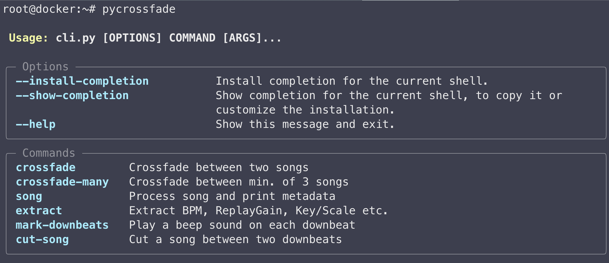
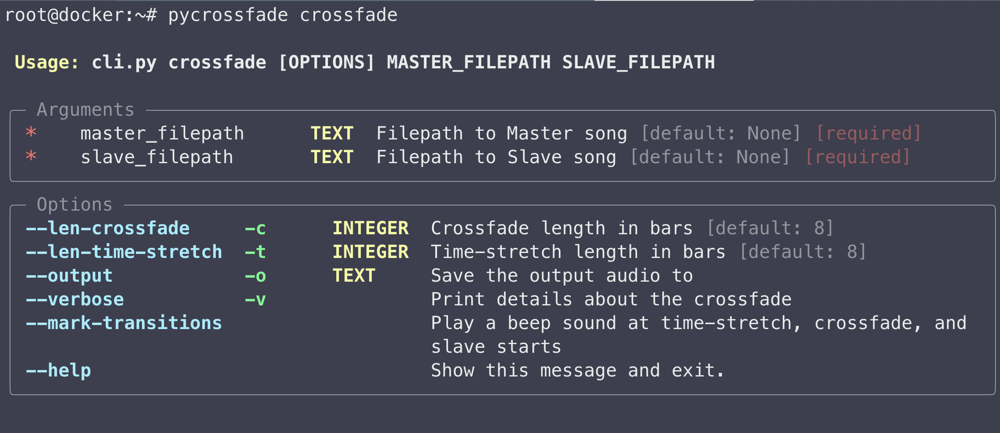

# pyCrossfade


pyCrossfade is born out of a personal effort to create a customizable and beat-matched crossfade functionality.

December 2024: ✨added CLI and Docker image✨

---

## CLI

Since the creation of this project, Python3 and dependencies got updated and stopped working with the pyCrossfade codebase.

### Docker Image

I've created a [Docker Image on ghcr.io](https://github.com/oguzhan-yilmaz/pyCrossfade/pkgs/container/pycrossfade) to help users getting the correct dependecy versions.

```bash
docker pull ghcr.io/oguzhan-yilmaz/pycrossfade:latest
```

### CLI Setup (for Linux)

To use the Docker image as a CLI, you'd need to:

- attach your `audios/` directory to the container
- attach a directory for persisting _pyCrossfade annotations_
- set some Env Vars for easier use.

This can be long and ugly, so the best thing to do is create a `alias` command.

Change the `MY_AUDIO_DIRECTORY` and add the following bash snippet to your `.bashrc` :

```bash
PYCROSSFADE_DIR="$HOME/.pycrossfade"
PYCROSSFADE_ANNOTATIONS_DIR="$PYCROSSFADE_DIR/annotations"

MY_AUDIO_DIRECTORY="$HOME/CHANGE_ME"

# create the alias command
alias pycrossfade="mkdir -p $PYCROSSFADE_DIR \
  && mkdir -p $PYCROSSFADE_ANNOTATIONS_DIR \
  && docker run --rm -it \
      -v "$MY_AUDIO_DIRECTORY:/app/audios" \
      -v $PYCROSSFADE_ANNOTATIONS_DIR:/app/pycrossfade_annotations \
      -e ANNOTATIONS_DIRECTORY=/app/pycrossfade_annotations \
      -e BASE_AUDIO_DIRECTORY=/app/audios/ \
      ghcr.io/oguzhan-yilmaz/pycrossfade:latest"
```

### CLI Usage

```bash
pycrossfade
```



```bash
pycrossfade crossfade --help
```



#### CLI Commands
- `song`: Process song beats and print metadata
  ```bash
  $ pycrossfade song horovel.mp3
  > Processing audio...
  > Audio loaded!
  Attribute             Value
  File                  /app/audios/horovel.mp3
  Name                  horovel
  Format                mp3
  Downbeats/Bars        136
  Beats                 541
  Duration              4:40
  DurationSeconds       280
  SampleRate            44100
  ```
- `extract`: Extract BPM, ReplayGain, Key/Scale etc.
  ```bash
  $ pycrossfade extract horovel.mp3
  > Processing audio...
  > Audio loaded!
  > Starting Essentia Music Extractor...
  Extractor Attribute                                Value
  Filename                                           horovel.mp3
  Duration                                           4:40
  Duration (seconds)                                 280.08
  BPM                                                122.90
  BPM (rounded)                                      123
  Sample Rate                                        44100
  Danceability                                       1.44/3.00
  Key/Scale estimation (edma)     [conf.: 0.65]      Eb minor
  Key/Scale estimation (krumhansl)[conf.: 0.64]      Eb minor
  Key/Scale estimation (temperley)[conf.: 0.63]      Eb minor
  Replay gain                                        -10.46
  Audio bit rate                                     128000
  Audio codec                                        mp3
  Number of channels (mono or stereo)                2
  MD5 hash for the encoded audio                     49aefedacc94152fb761a238e01ec86a
  ```
- `mark-downbeats`: Play a beep sound on each downbeat 
  ```bash
  $ pycrossfade mark-downbeats -o horovel-marked-db.wav horovel.mp3
  Song marked downbeats saved to: /app/audios/horovel-marked-db.wav
  ``` 
- `cut-song`: Cut a song between two downbeats
  ```bash
  $ pycrossfade cut-song horovel.mp3 35 65 -o horovel-cut-35-65.wav
  Song cut between downbeats 35:65/136 to: /app/audios/horovel-cut-35-65.wav
  ```
- `crossfade`: Crossfade between two songs
  ```bash
  $ pycrossfade crossfade \
      --verbose \
      --len-time-stretch 8 \
      --len-crossfade 8 \
      --mark-transitions \
      --output my_crossfade.wav \
      horovel-cut-35-65.wav hypnotic-cut-35-65.wav
    return array(a, dtype, copy=False, order=order)
  slave_fadein_end_idx                               708246
  time_stretch_start_idx                             1118817
  crossfade_start_idx                                1757824
  slave_start_idx                                    2424175
  time_stretch_start_seconds                         25.37
  crossfade_start_seconds                            39.85995464852608
  slave_start_seconds                                54.96995464852608
  slave_fadein_end_seconds                           16.06
  len_crossfade                                      8
  len_time_stretch                                   8
  saved_file                                         /app/audios/my_crossfade.wav
  ```
- `crossfade-many`: Crossfade between min. of 3 songs


---

## Older pyCrossfade

Before I added the CLI and Docker feature, I created the v0.1.0 tag. Access below:

- <https://github.com/oguzhan-yilmaz/pyCrossfade/releases/tag/v0.1.0>
- Older [Scripted Usage](docs/scripted-usage-deprecated.md) documentation

---

## About This Project

This project's main goal is to create seamless crossfade transitions between music files. This requires some DJ'ing abilities such as _bpm changing_, _beat-matching_ and _equalizer manipulation_.

#### Some Definitions on Music Domain

- [Beat](<https://en.wikipedia.org/wiki/Beat_(music)>)
  In music and music theory, the beat is the basic unit of time, the pulse or regularly repeating event.
  The beat is often defined as the rhythm listeners would tap their toes to when listening to a piece of music.

- [Bar (Measure)](<https://en.wikipedia.org/wiki/Bar_(music)>)
  In musical notation, a bar (or measure) is a segment of time corresponding to a specific number of beats, usually 4.

- [Downbeat](<https://en.wikipedia.org/wiki/Beat_(music)#Downbeat_and_upbeat>)
  The downbeat is the first beat of the bar, i.e. number 1.

### About Madmom's Beat Tracking

Madmom's Beat Tracking takes a long time to run, 45-150 seconds depending on the music file. It gives a `numpy array` as output, so when madmom finishes calculating, pyCrossfade saves/caches the said `numpy array` in a text file named after the song, under the folder `pycrossfade_annotations`. This makes pyCrossfade robust while working with same songs by avoiding heavy calculations every time.

### BPM Matching

The creation of a transition requires two songs, called master and slave songs. Master song is the currently playing track and slave song refers to the next track.

Master and slave tracks can be in different BPM's or speeds, so before applying crossfade, we have to gradually increase/decrease to master track's speed to match slave's speed. Let's say master song has 90 bpm, and slave song has 135 bpm. This makes slave song 1.5x faster than master song. If we were to suddenly increase the speed 1.5x that would be harsh on the listeners ear.

#### Gradually Time Stretching On Downbeats

Before applying crossfade, to match the bpm's of two songs, master song's speed is gradually increased on given number of downbeats. This ensures the listening experience quality. This works linearly as can be seen in the table below.

##### Example

```python
from pycrossfade.transition import crop_audio_and_dbeats \
                                   time_stretch_gradually_in_downbeats

from pycrossfade.song import Song
from pycrossfade.utils import save_audio

my_song = Song('some/path/to/a/song.mp3')

final_factor =  1.10 # times faster

# returns a new Song obj. cropped from my_song's between given parameter downbeats(or bars).
sample = crop_audio_and_dbeats(my_song, 50, 60) # sample of 10 bars

# increases the sample song's speed gradually
sample_but_faster_every_beat = time_stretch_gradually_in_downbeats(sample, final_factor)

save_audio(sample_but_faster_every_beat, 'some/output/path.wav', file_format='wav', bit_rate=320)
```

| bars                     | 1     | 2     | 3     | 4     | 5     | 6     | 7     | 8     | 9     | 10    | Final Factor |
| ------------------------ | ----- | ----- | ----- | ----- | ----- | ----- | ----- | ----- | ----- | ----- | ------------ |
| _Time Stretching Factor_ | 1.01x | 1.02x | 1.03x | 1.04x | 1.05x | 1.06x | 1.07x | 1.08x | 1.09x | 1.10x | _1.10x_      |

### Overview of the Transition

A simple visualization of all the processes would be like this:

> _master song_ | _bpm matching_ | _crossfade_ | _slave song_

> ı||ı|ı||||ı||ı||||ı|||ı||ı||ı||ı||ıı||ı||ı|ıı||ı|ıı||ııııııııııııııııııı

> --------------------------------ııııııııııııııııııı||ı||ııı|||ı||ııı|||ı||ııı|ıı||||ıı

### pyCrossfade's Approach To Perfect Beat Matching

Human ear can catch minimal errors easily thus making beat-matching is extremely important for any transition. Beat-matching would be easy if every beat had regular timing, but producers are doing their best to [humanize their songs](https://www.izotope.com/en/learn/how-to-humanize-and-dehumanize-drums.html), not playing every beat in regular timing to get nonrobotic rhythms.

#### A Visual Explanation

Here, I cut two songs between their 30th and 50th downbeats, resulting in the same amount of downbeats.


Red lines are denoting every _bar_, or it's delimiter _downbeats_.


This is the second song with 20 bars.


> First song's waveform is blue and it's bars denoted with red lines. Second song is shown with colors of orange and green.

When we put them on top of each other, we can see that their beats(red and green lines) is not matched, resulting in clashing of drums - or distorted audio.

Even though they have same amount of bars, resulting plot shows that second song is shorter. This is beacuse they have different BPMs - or speeds.

If every song had regular beat timing, then beat-matching would be easy as just time stretching the other song to match their speeds. However, because of _humanizing_, every bar can be different in length. For this reason, pyCrossfade applies beat matching on the level of bars.

##### Beat Matching on the level of every bar

pyCrossfade lets you define every transition's length in bars, lets take it as _K_ bars. Then it gets _master song_'s last K bars, and _slave song_'s first K bars, and applies beat matching on each bar. This is ensures the created transition is perfectly beat-matched even if the songs are _humanized_ or not.

### Possible Improvements

- Better(maybe Non-Linear) EQ Filtering
- Volume Balancing with Replay Gain
- Developing a better Crossfade EQ Filtering
